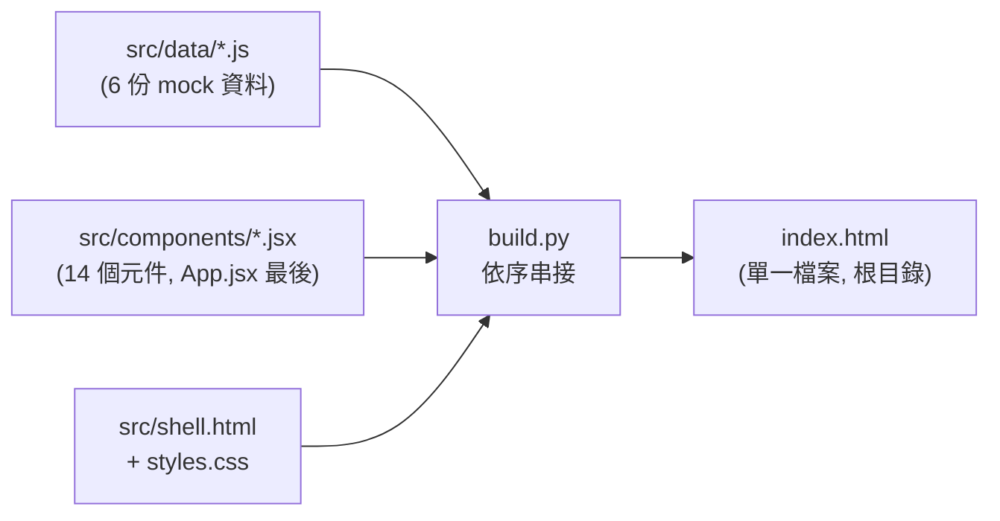

# 系統架構（Prototype 現況）

⚠️ 本頁描述的是 **UI prototype 的架構**，不是目標系統架構。目標系統的整合藍圖見 [ecp-strategy](../concepts/ecp-strategy.md)（外部系統地圖）與 [widget-governance](../concepts/widget-governance.md)（Widget Contract）。

## Build Pipeline（無 bundler，Python 拼裝）

- `build.py` 把 JS/JSX 模組**按依賴順序**串進 shell.html 的 `{{SCRIPT}}`：data → shared.jsx → 各 Page → **App.jsx 必須最後**。新增元件時要記得加進 `JS_MODULES` 清單，順序錯會 ReferenceError
- 指令：`cd "Agent portal" && python3 build.py`（或 `--output <path>`）
- **嚴禁直接改根目錄 index.html**（CLAUDE.md 路徑守則）——它是 build 產物

## Runtime 技術棧

| 層 | 選型 | 注意 |
|----|------|------|
| UI | React 18 **UMD development build**（unpkg CDN） | 非 production build，效能與體積未優化 |
| JSX | **Babel Standalone 瀏覽器內即時轉譯** | 開檔即編譯，大型頁面首載較慢 |
| 樣式 | Tailwind CDN + styles.css | 遵守 CLAUDE.md UI guideline（8px 系統、#2563EB 主色） |
| 依賴 | 全部走 CDN | **離線 / 廠內無外網環境開不起來**——demo 前要確認網路 |

## 前端結構

- **狀態提升至 App.jsx**：persona 切換、`handoverRecord`（SOP 交接報告產出→佈告欄→交班 Modal 那條線）、`DEFAULT_FUNCTION_TREE`（前後台共用）、`homeLayout`（v3.7 row-based 首頁）；Dark Mode 用 ThemeContext（v3.1）
- **AntD 橋接層**：`shared.jsx` 的 `AppConfigProvider` 從 ThemeContext 讀 isDark/字級 → 映射 AntD `ConfigProvider` theme token，並在內層包一個 `antd.App component={false}`（零 DOM）供各頁 `antd.App.useApp()` 取得吃主題的 `message`/`modal`；遷移進度見 [antd-migration-plan](../concepts/antd-migration-plan.md)
- 14 個 Page/元件 + shared.jsx（2026-07-25：刪 HandoverPage、加 SkillCreateFlow）；mock 資料集中在 `src/data/`（personas / tasks / scheduling / apps / kpiReportConfig / notifications）
- **hook 陷阱**：`renderHomeWidget()` 這類「被當一般函式呼叫」的渲染輔助函式裡不能有 hook——曾因裡面留了一個沒用到的 `useTheme()`，使該 hook 併入 `DashboardPage` 的序列，persona 切換使 widget 數量改變時就噴 React hooks order warning（2026-07-25 修）
- 尚無正式 Widget Contract——widget 是 Component 級靜態模擬（規模化風險見 [widget-governance](../concepts/widget-governance.md)）

## 架構層面的觀察（PM 視角）

1. 這套拼裝式架構是**為 demo 速度優化**的，換取了：無模組隔離、無 type check、無 tree-shaking。走向真實產品時（scrum 兩隊的後端工作，見 [teams](teams.md)），前端遷移到正式 bundler（Vite 等）幾乎不可避免，時點值得早於 Widget Contract v1 討論
2. ~~`src/data/personas.js.bak` 是遺留備份檔，建議清理~~ ✅ 已於 2026-07-25 刪除（連同死檔 `components/SOPManagementPage.jsx`，PO 核准；build 產物不變，見 [antd-migration-plan](../concepts/antd-migration-plan.md) Phase 8）
3. CDN 依賴 vs 廠內 VPN 環境（Widget timeout <1s 的前提）存在矛盾，正式化時需自建資源
