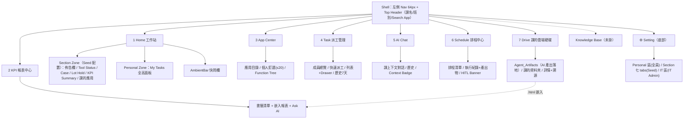

# 產品地圖

## 1. Sitemap（v3.6 Nav 順序）

> **2026-08-31**：新增 Drive（Nav 第 7 項，掛在 Schedule 之後；前六項順序是 v3.6 大老闆決議，不動）。它是 AI 產出的落地處，並把 `.html` 產出接到 KPI 報表中心，見 [drive](modules/drive.md)。

> **2026-07-25**：交班中心已廢除（PO 決議），節點自地圖移除。交班改為一個 SOP 的排程產出，在 Schedule 檢視、Home 佈告欄觸達，見 [handover](modules/handover.md)。

## 2. 堆疊模型（誰疊在誰上面）

| 層 | 內容 | 由誰決定 |
|----|------|---------|
| Shell | Nav、Header、Search App、persona 切換 | Platform |
| Page | 上表 10 個頁面 | Platform（Nav 順序 = 大老闆決議） |
| Zone | Home 的 Section / Personal Zone | Platform 定框架 |
| Widget | bulletin、kpi-summary、priority-feed… | Seed 排列（homeLayout）；AI 生成 priority-feed |
| Data | `src/data/` 9 份 mock（含 `drive.js`），以 persona（課）為範圍 | 未來接真實系統 |

技術堆疊（build、CDN）另見 [architecture](architecture.md)。

## 3. 三股跨模組互動流

**① Seed/IT 配置流（Setting → 前台）**：Setting 是治理中樞，改動即時反映前台——佈告欄 tab→Home 公告、KPI 閾值 tab→KPI Summary widget、首頁排版 tab→Section Zone 列結構、Application tab→課的應用 widget、KPI 報表管理 tab→KPI 中心書籤、IT Function Tree→App Center ☰ 與 Search App。

**② Ask AI 匯流（四處 → AI Chat）**：Priority Feed 卡片（帶 Task context）、KPI toolbar（帶報表定位）、AmbientBar（課上下文快問）、Schedule 延伸討論——一律開新對話 + Context Badge，規範見 [ai-chat](modules/ai-chat.md)。

**③ 任務／交班寫入流**：Task 派工 → 成員的 My Tasks 面板；SOP「整理當班交接報告」排程產出 → `handoverRecord`（App 層）→ Home 課佈告欄置頂 + 未讀高亮（同時進 Schedule 執行紀錄存查），`ShiftHandoverModal` 開啟時已預填、人補判斷後送出。這是「資料反向流回 Home」的兩條路。

**觀察**：Home 是所有流的匯聚點（① 的目的地、② 的起點、③ 的終點），符合「工作站」定位；AI Chat 是唯一的純匯入 hub。任何新功能規劃時先問：它接到哪股流？三股都接不上的功能要質疑其必要性。
